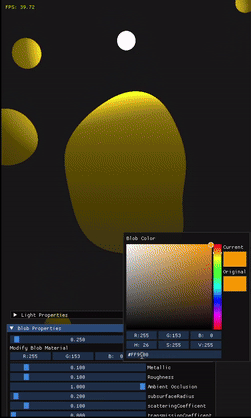
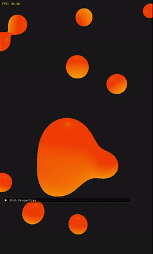

# Lava Lamp Emulator

This is a personal project to create a lava lamp emulator using OpenGL. The goal was to recreate the soothing, fluid-like motion of a lava lamp using rendering techniques like ray marching. This was inspired by [this web-based lava lamp](https://lucia-gomez.github.io/lava-lamp/), which I had often used while working to help me focus, and I wanted to try implementing it in 3D.

This project pushed me to dive deeper into shader programming and tackle the complexities of ray marching, teaching me new ways to think about rendering techniques. There were also a lot of challenges related to configuring the build system and setting up all the libraries with regards to OpenGL.

## Demo

  

    
PBR Lighting with sub-surface scattering approximation:

    
  

  

    
Phong Lighting:

    
  

## Features

- Realistic lava lamp effect using ray marching.

- Dynamic lighting and shading for immersive visuals.

- Adjustable parameters for blob motion, color, and light.

- Option between Phong lighting and PBR lighting

## Future Goals
- Adding a more complex simulation for movement

- Improving portability
